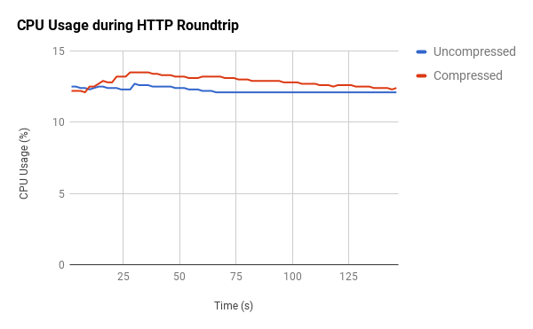

# Openshift with Accept-Encoding

 This repo contains relevant information to the performance effect of adding support for compressed responses using the `Accept-Encoding` HTTP header to the kubernetes API Server.

Changes were tested against [`9ffceb86a4be7652302e3edb3bc8261670ff1f48`](https://github.com/openshift/origin/commit/9ffceb86a4be7652302e3edb3bc8261670ff1f48). The changes tested can be viewed at https://github.com/ilackarms/origin/tree/compression

## Environment setup:
- Openshift Built & deployed from source as per https://github.com/openshift/origin/blob/master/CONTRIBUTING.adoc
- CPU Hardware:
```
→ lscpu
Architecture:          x86_64
CPU op-mode(s):        32-bit, 64-bit
Byte Order:            Little Endian
CPU(s):                8
On-line CPU(s) list:   0-7
Thread(s) per core:    2
Core(s) per socket:    4
Socket(s):             1
NUMA node(s):          1
Vendor ID:             GenuineIntel
CPU family:            6
Model:                 94
Model name:            Intel(R) Core(TM) i7-6820HQ CPU @ 2.70GHz
Stepping:              3
CPU MHz:               799.914
```
- Memory:
```
→ free
              total        used        free      shared  buff/cache   available
Mem:       15844752     4418684     4628620      751172     6797448    10189916
Swap:       7991292      669440     7321852
```
- Created large dataset (50,000 images) using [create_images.sh](scripts/create_images.sh).
- Requests were sent from a host in Tel-Aviv to Boston, with 580ms ping latency.

## Results

After creating the 50k images, the result of a `cURL -X GET` against `https://localhost:8443/oapi/v1/imagestreams` has a 66mb response body. The data, when compressed with gzip, shrinks to 1.12mb.

 

Note: Compressed size will vary depending on the actual data being compressed, as well as the compression algorithm being used. Less redundant data will not be as compressible.

Response latency differed by an average of 11 minutes for each request:


While average CPU usage was higher for `openshift` when returning compressed responses by an average of 1% compared with uncompressed:


